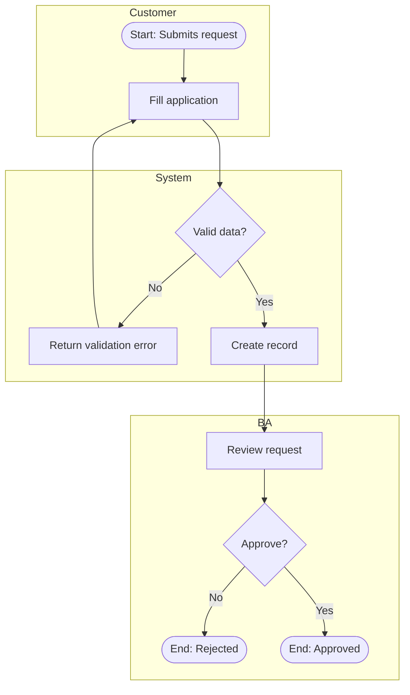

# Process Modelling

A process model needs to answer three questions at a glance: **who does what, in what order, and what happens at each decision point** — including when things go wrong, not just the happy path.

## Approach

1. **Identify the actors/swimlanes** — every role or system that performs a step (e.g. Customer, BA, System, Compliance). A process with only one actor is rarely realistic; check if you're missing handoffs.
2. **List the steps in sequence**, tagging each with its actor and whether it's a task, decision (gateway), or event (start/end/intermediate, e.g. "timer", "message received").
3. **Surface decision points explicitly** — every gateway needs its branches labeled with the condition, and every branch needs to go somewhere (don't leave a path dangling).
4. **Cover exception/alternate paths**, not just the happy path — what happens on rejection, timeout, validation failure, or cancellation. This is the part most first drafts miss.
5. **Mark start and end events** clearly — a process model without a clear terminus isn't finished.

## BPMN notation reference (simplified)

- **Event** (circle): start (thin), end (thick), intermediate (double) — e.g. timer, message
- **Task** (rounded rectangle): a unit of work by one actor
- **Gateway** (diamond): decision point — exclusive (only one path), parallel (all paths), or inclusive (one or more)
- **Swimlane/pool**: groups steps by actor or system
- **Sequence flow** (solid arrow): order of execution
- **Message flow** (dashed arrow): communication between separate pools/systems

## Rendering

Use a Mermaid flowchart with subgraphs as swimlanes when producing a diagram in an artifact or markdown:

Pair every diagram with a short numbered description of each step (actor, action, and any business rule that applies) — the diagram shows flow, the text carries the detail a developer needs.

## As-Is vs. To-Be

When modeling both, keep the actor/swimlane structure as similar as possible between the two diagrams so the *change* is visually obvious (removed steps, new automation, changed handoffs) rather than requiring the reader to diff two unrelated layouts.

## Completeness checklist

- [ ] Every actor/system that touches the process has a swimlane
- [ ] Every gateway's branches are labeled and all branches terminate
- [ ] Exception paths are modeled, not just the happy path
- [ ] Start and end events are present and unambiguous
- [ ] Each step is a single, well-named action (not a paragraph)
