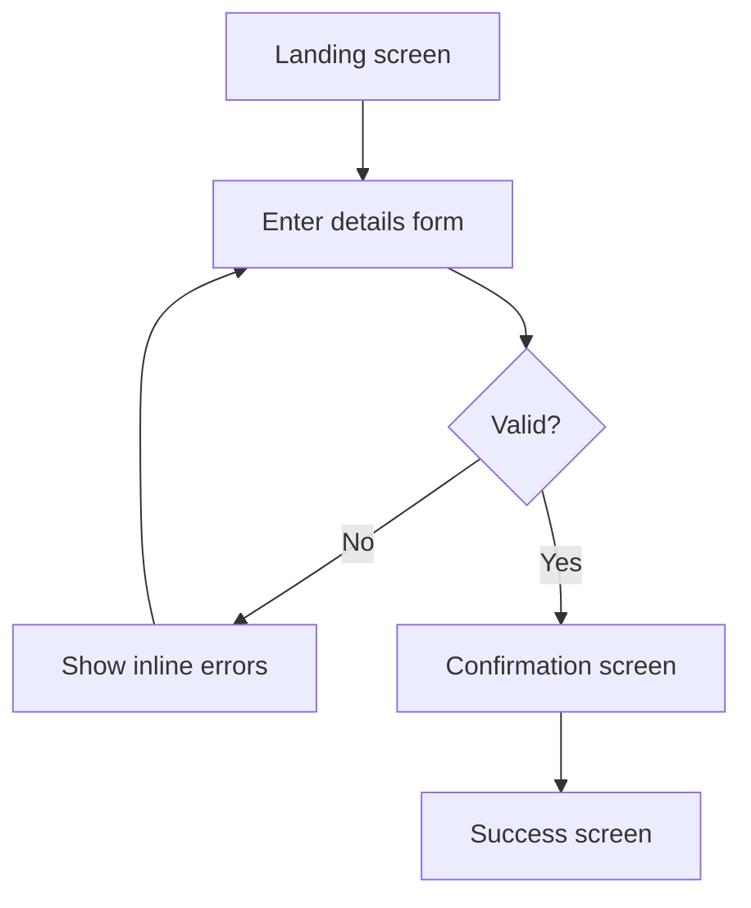

# Visualization, Prototyping

The deliverable here is a specification a designer or developer can work from — precise about what's on each screen, how screens connect, and what happens on each interaction — even though it's expressed as structured text and diagrams rather than pixels. If the user wants an actual visual mockup built (e.g. in Figma), route to the Figma tools instead; this skill covers the BA-level flow/content spec that typically precedes that.

## User flow

Map the sequence of screens/steps a user moves through to accomplish a goal, including branches (errors, alternate paths, cancel/back). Render as a Mermaid flowchart when a visual is useful:



## Screen specification

For each screen in the flow:

```markdown
### Screen: [Name]
**Purpose:** [What the user is trying to do here]
**Entry point:** [How the user gets here]
**Contents:**
- [Element]: [type — input/button/table/text], [behavior/validation]
**Primary action:** [button/CTA] → [where it goes]
**Secondary actions:** ...
**Error/empty states:** [what shows when data is missing, invalid, or an error occurs]
**Exit points:** [where else the user can go from here]
```

Be specific about states that are easy to forget: empty state (no data yet), loading state, error state, and the state after a successful action — a spec that only describes the "happy, populated" view is incomplete.

## Low-fidelity layout description

When an actual layout sketch helps (not just a content list), describe it as a simple structured block rather than attempting detailed visual design:

```
┌─────────────────────────────┐
│ Header: [Title]              │
├─────────────────────────────┤
│ [Field: Name]                │
│ [Field: Email]                │
│ [Button: Submit] [Button: Cancel] │
└─────────────────────────────┘
```

This communicates layout intent (grouping, hierarchy, primary vs. secondary actions) without pretending to be a real mockup — leave visual polish to the design tool.

## Checklist before delivering

- [ ] Every screen in the flow has a defined entry point and at least one exit
- [ ]  Error, empty, and loading states are specified, not just the ideal-data view
- [ ] Navigation is unambiguous — no screen is a dead end unless intentional
- [ ] The flow traces back to the original requirement (nothing invented that wasn't asked for, nothing required left unaddressed)

Note that user flow *coverage* and *navigation logic* can be checked objectively against the requirement; overall UX quality (is this actually a good design?) needs human judgment — say so rather than asserting a subjective design choice is correct.
